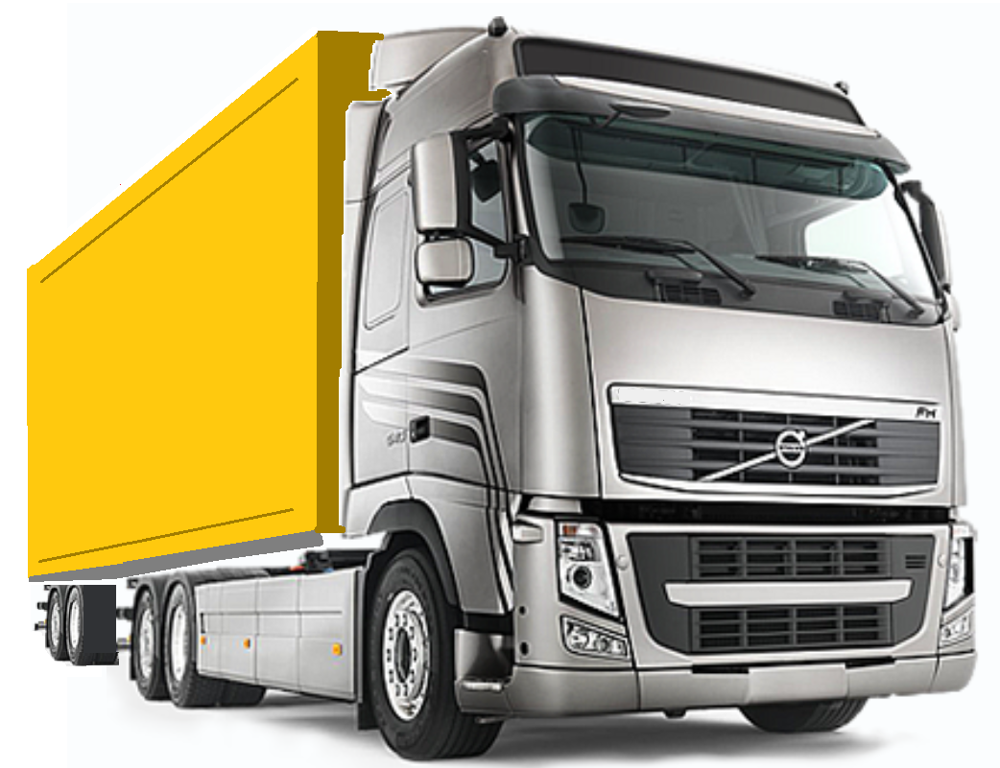
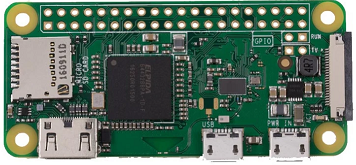
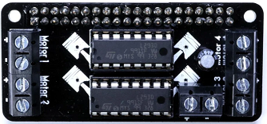
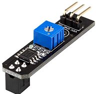
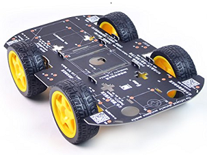
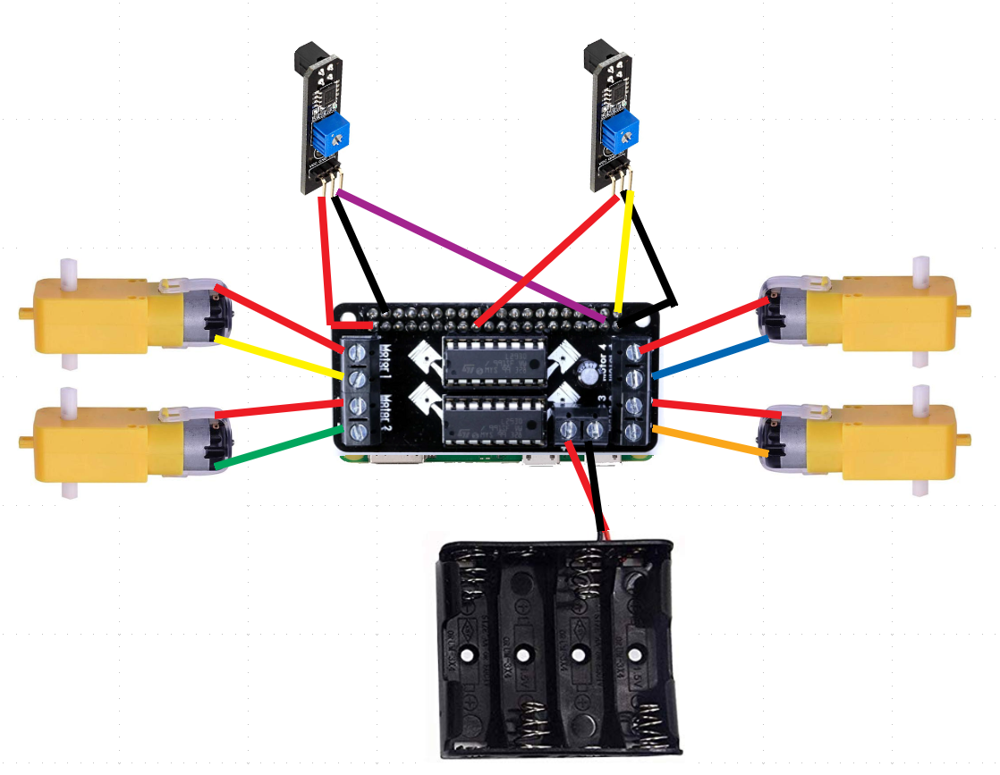

<h1>Making Bumblebee AV</h1>

<b>Bumblebee AV is a miniature autonomous vehicle designed to be an affordable way to introduce youth or adults to robots and artificial intelligence</b>

Buy <a href="https://thepihut.com/collections/raspberry-pi/products/raspberry-pi-zero-w">a Raspberry Pi Zero W</a> and
<a href="https://thepihut.com/products/motozero">a MotoZero motor controller</a>

<table><tr><td>

  </td><td>

  </td></tr></table>
  
The Raspberry Pi Mega Kit includes a Raspberry Pi Zero W with a GPIO header attached so you don't have to solder.  
It also has a 16GB MicroSD memory card with the Raspbian operating system already installed.  
You may use your own memory card and <a href="https://www.raspberrypi.org/downloads/raspbian/">download and install Raspbian</a>

Get a <a href="https://www.adafruit.com/product/4079?gclid=EAIaIQobChMIn9_Huv_55gIV0RZ9Ch3ndg71EAQYBiABEgLLwvD_BwE">stacking header</a> 
so you can connect to the Raspberry Pi GPIO pins after you install Motozero.

You also need LEDs if you want to install brakelights and at least two <a href="https://www.amazon.com/RobotDyn-tracking-Arduino-projects-Digital/dp/B077SQ1NN4/ref=asc_df_B077SQ1NN4/?tag=&linkCode=df0&hvadid=380200604373&hvpos=1o4&hvnetw=g&hvrand=6984096978951811916&hvpone=&hvptwo=&hvqmt=&hvdev=c&hvdvcmdl=&hvlocint=&hvlocphy=9031390&hvtargid=pla-814806945521&ref=&adgrpid=82910274452&th=1">black and white path followers</a> 

<table><tr><td>

  </td><td>

  </td></tr></table>

If you like kits, the <a href="https://thepihut.com/products/camjam-edukit-3-robotics">Camjam Edukit #3 - Robotics</a>
contains everything you need plus an obstacle avoidance sensor for future projects.  However, this kit only has two wheels with a coaster wheel.  My robot got lost trying to follow a line because it would spin too far right or left when it was finding the line.
Adding a <a href="https://www.amazon.com/Robot-Chassis-Motor-Arduino-Raspberry/dp/B07F759T89/ref=asc_df_B07F759T89/?tag=hyprod-20&linkCode=df0&hvadid=312123579962&hvpos=1o13&hvnetw=g&hvrand=8626614890372170226&hvpone=&hvptwo=&hvqmt=&hvdev=c&hvdvcmdl=&hvlocint=&hvlocphy=9031390&hvtargid=pla-572041604638&psc=1&tag=&ref=&adgrpid=65834404201&hvpone=&hvptwo=&hvadid=312123579962&hvpos=1o13&hvnetw=g&hvrand=8626614890372170226&hvqmt=&hvdev=c&hvdvcmdl=&hvlocint=&hvlocphy=9031390&hvtargid=pla-572041604638">chassis</a> to support four wheels made it easier to control.  I bought two more wheels and motors and replaced the kit's motor controller with Motozero.

<h3>Wiring your robots</h3>

Each line follower connects VCC to 3v power, GND to ground, and the DC input channel to either GPIO pin 21 or 26.  
Be careful not to use GPIO pins already being used by Motozero or you may get unexpected results.  
Page 26 of the <a href="MotoZero_User_Guide_1.2.pdf">Motozero User Guide</a> explains the motor controller wiring.

<h3>Interacting with Raspberry Pi Zero W</h3>

Use a miniHDMI-to-HDMI adaptor to connect Enviro to a monitor or TV.  Use a microUSB-to-USB adaptor to plug-in a keyboard or mouse.  I recommend a [USB hub](https://www.bestbuy.com/site/insignia-4-port-usb-3-0-hub-black/4333600.p?skuId=4333600&ref=212&loc=1&ref=212&loc=1&gclid=EAIaIQobChMI0_6gr9_P6QIVT-zjBx3WpAuAEAQYBCABEgKemvD_BwE&gclsrc=aw.ds) so you can connect both of them.  Power Raspberry Pi with a wall plug or a USB battery capable of powering mobile phones.

You can connect remotely using Secure Shell (SSH) but you must enable SSH.  Click the  raspberry icon on the menu.  Select "Preferences", then select "Raspberry Pi Configuration".  Click the "Interfaces" tab and enable "SSH".  

<h3>Taking a trip</h3>

<a href="motors.md">Test driving Bumblebee AV</a>
